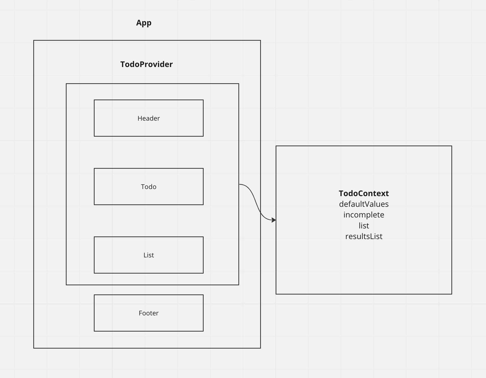

# To Do List

## Description
A web application that allows you to manage to-do tasks in a list.

## Deployed Site Demo
https://dev--dainty-brioche-551c49.netlify.app/

## Installation
* Requires npm and node.js to run.
* Run npm install to install dependencies.
* Use npm start to run application.

## Global State and Context
In the current implementation, we have a few state options that are being used across multiple components:
* Pagination state
* Incomplete/Complete tasks
* Section of List being displayed

So we have all of these in Context and we allow Todo, List, and Header to "consume" these state values through Context.

## useForm() hook
This hook takes a callback and an object with default values as its parameters.
It also has a few built-in functions that can be called:
* Update the state of values from a form submission.
* Perform the given callback function on the current state of values.

## UML
